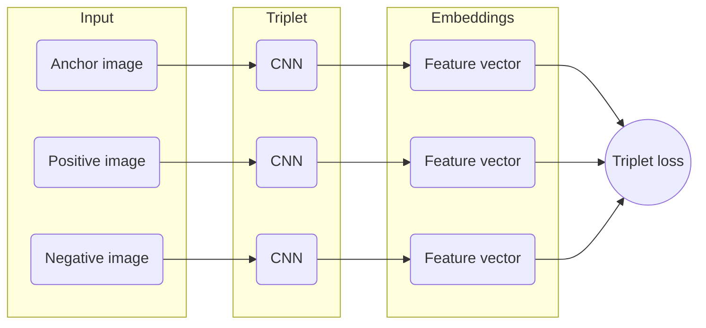

# Recoinize - Coin recognition made easy

## Motivation 

The field of computer vision has made significant progress in recent years, enabling machines to recognize and understand visual content to a greater extent than ever before. One particular area of interest is object recognition, which involves identifying and categorizing objects in digital images. However, even with state-of-the-art algorithms and techniques, coin recognition remains a challenging problem due to the complexity and variability of the coins.

Recognizing coins has practical applications in various domains, from vending machines to banking and finance. Accurately identifying and classifying coins can streamline processes, reduce errors, and increase efficiency in various industries. Furthermore, developing an efficient and reliable system for coin recognition can significantly benefit individuals who are visually impaired, allowing them to more easily distinguish between different coins.

In this project, we propose an AI-based approach to recognize euro coins. Specifically, we will train a neural network using a siamese or triplet architecture to find the optimal parameters to associate each image with a highly discriminative output vector. We will then use this network to classify and identify the coins in our dataset. Our approach is designed to provide accurate and efficient results while overcoming the inherent complexity and variability of coin recognition.

Overall, our work has the potential to make significant contributions to the field of computer vision and practical applications in various industries. By developing an efficient and reliable system for coin recognition, we can improve accuracy, streamline processes, and increase accessibility for individuals who are visually impaired.

## Dataset creation

The main struggle that this project came with, was the absolute lack of usable pictures of coins we had for three main reasons:
- Firstly, **cash usage is increasingly uncommon** in daily life, with most people opting to pay using credit cards or mobile devices. We thought about asking a cashier at a store for change, but this came with the downside of having to initiate a social interaction with a person we didn't know, which as a computer scientist is known to be close to impossible.
- Secondly, our goal was to **identify one-of-a-kind types of coins**, since our tool targeted collectors and specialists, which would not be readily available in circulation, and **could neither be acquired easily nor for reasonable amounts of money**. For reference, buying about 100 of these limited edition coins would've costed us about 30000€.
- Finally, the process of capturing well-lit and high-quality images of coins demanded **considerable time and effort**, requiring the use of some sort of automated contraption, which we lacked the time or the money to build.

After careful consideration of the pros and cons of each alternative which came to mind, it was deemed best to generate images using a **rendering software** such as Blender. We scrapped hundreds of coins from the internet (more specifically from the European Central bank's website), cut out the excess background, and programatically generated textures for our coin 3d models using **Hough circle detection** to crop the images to the correct shape.

|![[at_2euro.jpg\|340]]|![[at_2euro.texture.png]]|
|---------------------|------------------------|
|*Fig. 1: Original image scrapped from the ECB website* | *Fig. 2: Programmatically generated cylinder texture* |

A blender scene consisting of a high resolution cylinder (representing the coin) and a rectangular parallelepiped (which acts as the ground/table upon which the coin lies) will be used to generate the different shots. 

|![[scene_wireframe.png]] | ![[scene_rendered.png]] |
|--------------|----------------|
| *Fig. 3: Wireframe view of the scene* | *Fig. 4: Rendered view of the scene*  |

The rendering process is fully automated using a python script, which single-handedly randomizes the camera position (whose frustum is visible in *Fig. 3* & *Fig. 4*), the lighting, the concrete texture in the background, and the amount of rust on the surface of the coin, using shaders. This process of randomization and rendering is executed $X$ amount of times for each coin, where $X$ is a predefined constant, which enables the generation of a nearly infinite amount of images from just a couple of pictures downloaded from the Internet.

However, one of our major concern was, and still is, that rendering images using a 3D engine may produce results which would be different from real pictures, in a way that is too subtle for humans to distinguish (missing artefacts, noise or other influencing factors). We will see later how this affected our results.

Example code snippets used to automate the scene alteration and rendering process:
```python
# Set the camera's position around the coin
bpy.data.objects["Camera"].location = (random.uniform(-2, 2), random.uniform(-2.5, -3), random.uniform(-2, 2))

# Set the coin's rotation around the y-axis
coin.rotation_euler = (coin.rotation_euler[0], random.uniform(0, 6.28), coin.rotation_euler[2])

# Render the image
bpy.context.scene.render.filepath = os.path.join(
	OUTPUT_DIR, f"{name}_{i}")
bpy.ops.render.render(write_still=True)
```

## Theoretical background

Coin recognition is a challenging problem in computer vision due to the complexity and variability of coins. Coins come in different sizes, shapes, and colors, and can exhibit a wide range of visual characteristics such as scratches, dents, and dirt. Therefore, developing an efficient and reliable system for coin recognition requires the use of advanced algorithms and techniques in computer vision.

One popular approach to coin recognition is the use of convolutional neural networks (CNNs), which have achieved state-of-the-art performance in various computer vision tasks. However, traditional CNNs are not well-suited for such a use case because they require large amounts of labeled data to train effectively, which is often not available in this domain. Furthermore, we expect new coins to be released every year, sometimes even at higher frequencies, which would require an update to the model every time an addition is made to the database.

To overcome this challenge, we propose the use of a siamese or triplet architecture, which is a variant of CNNs that are designed to work with small datasets by learning to compare or contrast pairs or triplets of images rather than classifying individual images. This approach allows us to train a network with a smaller amount of labeled data and achieve better performance on the task of coin recognition.

This report will be focusing on the triplet approach, which is based upon the work of the **Machine Perception** team at Google Research. As a matter of fact, triplet loss was first introduced in **FaceNet: A unified Embedding for Face Recognition and Clustering**[^1], a paper by Florian Schroff, Dmitry Kalenichenko and James Philbin published in 2015. It supposedly offers betters results than siamese training structures thanks to its ability to learn more fine-grained features, which leads to a better discrimination between similar classes.

The triplet architecture consists three identical subnetworks that share the same weights and are trained jointly using triplets of images as inputs. The subnetworks learn to extract features from the images, and the output of each subnetwork is a high-dimensional feature vector that represents the image, its "fingerprint" in a way. The similarity between two images is then computed by comparing the feature vectors using a distance metric such as cosine similarity or Euclidean distance. The network is trained by minimizing the distance between similar pairs or maximizing the distance between dissimilar pairs, as shown below:



In the context of coin recognition, we can use the triplet architecture to train a network to learn the similarity between different images of the same coin or the differences between images of different coins. This approach allows us to overcome the challenges of limited labeled data and the complexity and variability of coins, as the network can learn to recognize coins based on their unique visual characteristics.

Overall, the use of a siamese or triplet architecture for coin recognition has the potential to significantly improve the accuracy and efficiency of coin recognition systems, making them more accessible and useful in various industries and for individuals who are visually impaired.

## Implementation

> [!question]
> *How did you implement your approach? which tools were used? show interesting snippets or present your algorithms*

In this approach, the loss function for the triplet training structure is as follows:
$$
\begin{equation} L(a,p,n) = \max(0, d(a,p) - d(a,n) + \alpha) \end{equation}
$$

where $a$ is the anchor input, $p$ is the positive input, $n$ is the negative input, $d$ is a distance function (such as Euclidean distance), and $\alpha$ is a margin parameter

## Evaluation

> [!question]
> *Present and visualize results of your evaluation, explain what do your results mean, why was your approach successful, why not? compare it to some baseline either implemented yourself or from the literature, blogs, Kaggle, etc.*

## Conclusion

> [!question]
> *How can you evaluate the results of your work? what would you recommend for future steps?*


[^1]: add this before sending