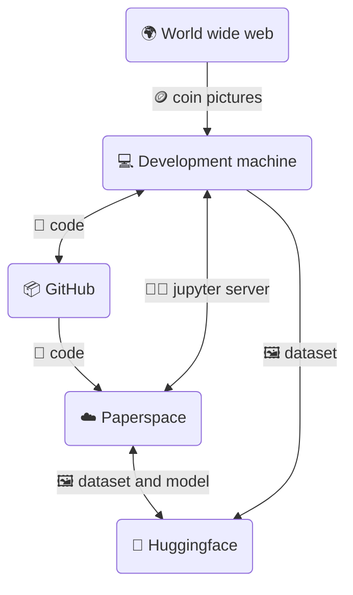

#machine-learning #coin-recognition #flowchart

```mermaid
flowchart TB
	gh("📦 GitHub")
	ps("☁️ Paperspace")
	hf("🤗 Huggingface")
	pc("💻 Development machine")
	ws("🌍 World wide web")
	pc <-- "💾 code" --> gh
	gh -- "💾 code" --> ps
	pc <-- "🧑‍💻 jupyter server" --> ps
	ps <-- "🖼️ dataset and model" --> hf
	pc -- "🖼️ dataset" --> hf
	ws -- "🪙 coin pictures" --> pc
```

